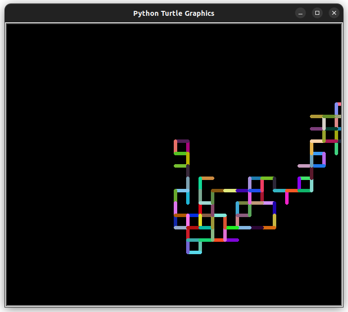

# Random Walk Algorithm

Tejas [twitter](https://twitter.com/achte_te)

Visualization of Random Walk Algorithm.

### Requirements:
[Turtle](https://docs.python.org/3/library/turtle.html)


To Run:

```sh
git clone git@github.com:achte-2022/Random-Walk.git
cd Random-Walk
python3 main.py
```

### Output Image 1:


### Output Image 2:

